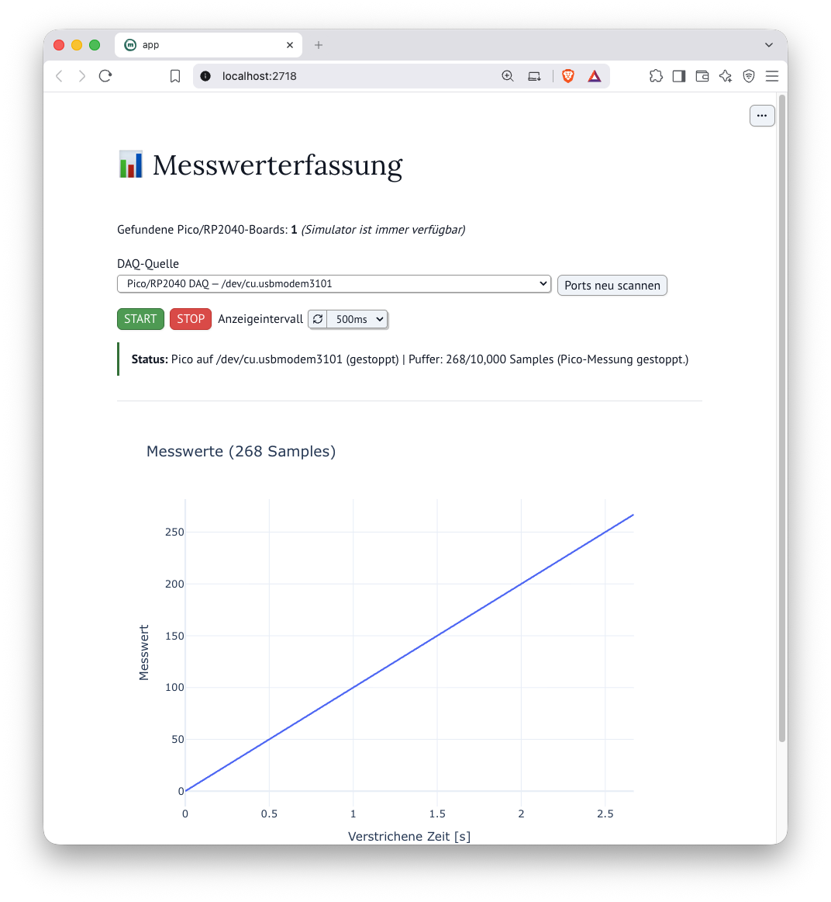

# marimo-daq-pipeline

> **Wie lässt sich der Weg von der physikalischen Messung zur interaktiven Auswertung drastisch verkürzen?**  
> Dieser Demonstrator zeigt, wie schnell ein Prototyp zur Messdatenverarbeitung aufgebaut werden kann. Aus dem **Marimo Notebook** heraus wird die Messwerterfassungskarte via USB eingebunden. Dort werden die Daten visualisiert und stehen direkt in einem **Polars DataFrame** zur Weiterverarbeitung zur Verfügung.

Die Messwerterfassung erfolgt mittels eines **Raspberry Pi Pico** (USB-CDC). Zur Veranschaulichung wird in dieser Demo ein ansteigender Messwert im 100-Hz-Takt simuliert. Sollte keine Hardware angeschlossen sein, schaltet die Applikation automatisch auf einen internen Software-Simulator um.

<p align="center">
  
</p>

*Das Marimo-Dashboard visualisiert die Messwerte in Echtzeit. Als Datenquelle kann entweder ein angeschlossener Raspberry Pi Pico oder der integrierte Software-Simulator verwendet werden.*

##  Tech-Stack 

* **Hardware / Firmware:** Raspberry Pi Pico (MicroPython)
* **Paketverwaltung:** [`uv`](https://github.com/astral-sh/uv)
* **Frontend / Dashboard:** [Marimo Notebook](https://marimo.io) (Reaktives Python-Notebook)
* **Data Engineering:** [Polars](https://pola.rs) (High-Performance DataFrames)
* **Visualisierung:** [Plotly Express](https://plotly.com/python/)
* **Schnittstelle:** PySerial (USB-CDC Streaming)

### Der "Rusty Python Stack": High-Performance & Moderne Tooling-Kultur

Rust hat das Python-Ökosystem revolutioniert. Durch die Kombination von Rust-Powered Tooling mit der Flexibilität von Python entsteht eine Umgebung, die in Sachen Geschwindigkeit, Reproduzierbarkeit und DX (Developer Experience) neue Maßstäbe setzt. Dieser Demonstrator setzt konsequent auf diesen **"Rusty Python Stack"**:

* **uv:** Der extrem schnelle, in Rust geschriebene Paket- & Projektmanager garantiert reproduzierbare Builds.
* **Polars:** Die in Rust entwickelte DataFrame-Engine bietet extrem performante, speichereffiziente Zeitreihen- und Datenverarbeitung.

Ergänzt wird dieser Stack durch **Marimo**: Eine reaktive UI- & Dashboard-Engine für Datenanwendungen.


## Projektstruktur

```text
marimo-daq-pipeline/
├── app.py                # Marimo-Dashboard und Auswertung
├── daq/                  # PC-seitige Datenerfassung
│   ├── base.py           # Reader-Schnittstelle und Sample-Puffer
│   ├── controller.py     # Auswahl und Lebenszyklus der Datenquelle
│   ├── pico.py           # USB-CDC-Reader für den Raspberry Pi Pico
│   ├── simulator.py      # Interner 100-Hz-Software-Simulator
│   └── sources.py        # Erkennung verfügbarer DAQ-Quellen
├── firmware/
│   ├── main.py           # MicroPython-Firmware für den Pico
│   └── README.md         # Hinweise zur Firmware
├── tests/
│   └── test_daq.py       # Tests der Datenerfassung
├── pyproject.toml        # Projekt- und Abhängigkeitskonfiguration
├── uv.lock               # Reproduzierbar aufgelöste Abhängigkeiten
└── README.md             # Projektdokumentation
```

## Installation und Start

In diesem Repository:

```bash
uv sync
uv run marimo edit app.py
```

## Firmware auf den Pico übertragen

Einmalig muss die Micropython Laufzeit-Umgebung auf den Pico kopiert werden.
Anschließend wird die Datenakquisations-Firmware Projektdatei `firmware/main.py` als `main.py` auf das MicroPython-Dateisystem kopiert.

### 1. MicroPython einmalig per BOOTSEL installieren

1. Die zum Board passende aktuelle UF2-Datei aus dem offiziellen
   [MicroPython-Downloadkatalog](https://micropython.org/download/?port=rp2)
   herunterladen. Pico, Pico W und andere RP2040-Boards benötigen jeweils das
   für ihr konkretes Board angebotene Image.
2. Pico vom USB trennen.
3. **BOOTSEL** gedrückt halten, USB verbinden und BOOTSEL wieder loslassen.
4. Das Laufwerk `RPI-RP2` erscheint. Die heruntergeladene `.uf2`-Datei darauf
   kopieren. Der Pico startet danach automatisch mit MicroPython neu.

Dieser Schritt muss nur bei der Erstinstallation oder einem Wechsel der
MicroPython-Version wiederholt werden.

### 2. DAQ-Anwendung mit `uvx mpremote` installieren

Zuerst das Marimo-Notebook und andere Programme schließen, die den seriellen
Port geöffnet haben. Verfügbare MicroPython-Geräte anzeigen:

```bash
uvx mpremote connect list
```

Bei genau einem angeschlossenen Pico die Anwendung übertragen:

```bash
uvx mpremote connect auto fs cp firmware/main.py :main.py
```

Bei mehreren Geräten den Port explizit angeben:

```bash
# Windows
uvx mpremote connect COM3 fs cp firmware/main.py :main.py

# Linux
uvx mpremote connect /dev/ttyACM0 fs cp firmware/main.py :main.py

# macOS – tatsächlichen Port aus "connect list" einsetzen
uvx mpremote connect /dev/cu.usbmodem1101 fs cp firmware/main.py :main.py
```

Anschließend den Pico kurz vom USB trennen und erneut verbinden oder seine
Reset-Taste drücken. Weil die Datei auf dem Gerät `main.py` heißt, startet die
DAQ-Firmware danach automatisch. Bei späteren Codeänderungen ist nur Schritt 2
erneut erforderlich.

### 3. Funktion prüfen

```bash
uvx mpremote connect auto fs ls
```

In der Ausgabe muss `main.py` erscheinen. Danach `uv run marimo edit app.py`
starten, **Ports neu scannen** wählen und den Pico als DAQ-Quelle auswählen.

Die PC-seitige Erfassung liegt unabhängig vom Notebook im Paket `daq/`:

- `base.py`: gemeinsame Reader-Schnittstelle und threadsicherer Sample-Puffer
- `pico.py`: ausschließlich USB-CDC/PySerial
- `simulator.py`: ausschließlich der interne 100-Hz-Simulator
- `sources.py`: Quellmodelle und Pico/RP2040-Porterkennung
- `controller.py`: Wechsel und Lebenszyklus des ausgewählten Backends

`app.py` enthält die Marimo-Oberfläche und Auswertung. Nach dem Start erscheit das Dashboard.
Dort kann die Daten Datenquelle ausgewählt werden:
Falls ein Pico anschlossen ist, wird dieser Port erkannt, der Simulator `Software-Simulator (Mock)` ist immer verfügbar.
Die Quellenauswahl erkennt Pico/RP2-Ports mit der MicroPython-USB-Kennung
`2E8A:0005` sowie Geräte, die sich in ihren USB-Metadaten ausdrücklich als
`RP2040` ausweisen. Sonstige serielle Ports, Bluetooth-Geräte und Raspberry-Pi-
Debug-Probes werden ausgeblendet.
START leert den Puffer und startet die Messwerterfassung und Visualisierung.
STOP beendet die Messwerterfassung.

Jeder Pico-`START` setzt den Messwert und den messungsrelativen Zeitstempel auf
null. Bei 100 Hz entstehen somit Datensätze wie `0,0`, `10,1`, `20,2`.
